# 基于Bezier曲线的三维造型和渲染 项目报告

计53 王润基 2015011279

## 使用说明

使用CLion的Release模式编译项目，生成程序在`cmake-build-release`目录下。

在终端中进入该目录，输入以下命令渲染指定场景：

```
./2RayTrace <场景描述文件json>
```

例如：

```
./2RayTrace ../data/scenes/dragon.json
```

渲染过程可能进行若干轮，每轮完成后，结果会在窗口中显示，并自动保存在`image`目录下。

此外还有一个合并图片的功能，用于把多次随机采样的结果合并。

```
./2RayTrace merge <image1> [image2] ...
```

场景文件格式标准见`data/scenes/sample.json`，里面描述了所有实现的功能和可调的参数。

## 实现功能

*注：标记※为基本实现但尚有问题，不应用于最终渲染中的功能*

*注：每项功能后面标注了对应的类名，方便搜索查验*

* 渲染算法`Renderer`
  * 光线投射`LightProjection`
  * 光线追踪`RayTracer`
  * ※路径追踪`PathTracer`
  * ※双向路径追踪`BiPathTracer`
  * ※渐进式光子映射`ProgressivePhotonMaps`
* 支持的特性
  * 材质及物理特性`Material`
    * 环境光，自发光
    * BRDF/BRTF：漫反射，漫折射，镜面反射，折射（折射率）
  * 光源`LightSource`
    * 点光源，聚光灯，矩形面光源，平行光
  * 形状`Shape`
    * 1维：Bezier曲线
    * 2维：Bezier曲面，绕轴生成曲面，平面，三角面片
    * 3维：平行于坐标轴的长方体（包围盒），球，复杂网格
  * 变换`Transform`
    * 平移，旋转，缩放
* Bezier曲面
  * 使用牛顿迭代求交，理论上支持任意参数曲面`ParameterSurface`
  * 支持任意次的Bezier曲面（复杂度O(n^3)）`BezierSurface`
  * 支持任意次的Bezier曲线绕轴旋转`Lathe`
* 加速算法
  * 层次包围盒（BVH with SAH）`AABBTree`
  * OpenCV自带多线程操作
* 其它特性
  * x4超采样抗锯齿`Renderer::super`
  * 景深`Camera::aperture`
  * 面光源（软阴影）`RectLight`
  * 纹理贴图`Texture`，纹理重映射`UVMaps`
  * 复杂网格`TriangleMesh`
    * obj文件读取与保存
    * 法向插值
* 项目特性
  * 高度模块化
  * 使用json作为场景描述文件，参数丰富可调
* 评分细则确认
  * 基本光线跟踪（60%）
  * 高次曲面求交（40%）
  * 渲染加速（5%）
  * 超采样抗锯齿（5%）
  * 贴图/景深（10%）

## 效果展示

*注：渲染主机CPU：Intel i5-4670，4核并行计算*

### 基本特性

4次Bezier曲面（渲染约1s）

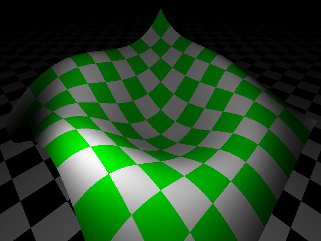

复杂网格（200k面片，渲染约10s）

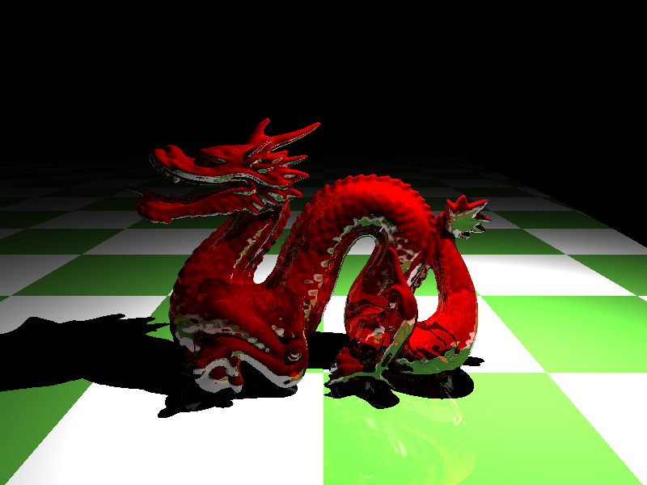

景深

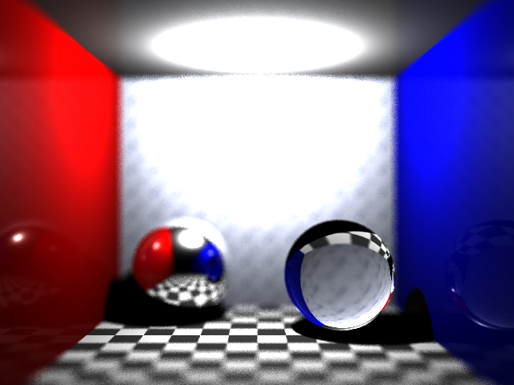

绕轴旋转曲面

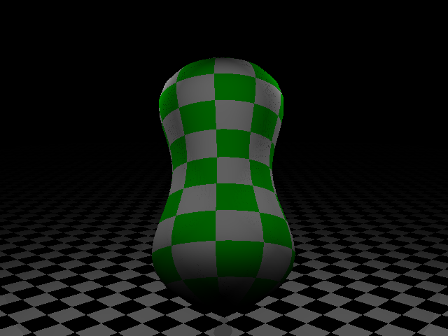

路径追踪（每像素采样1000次）

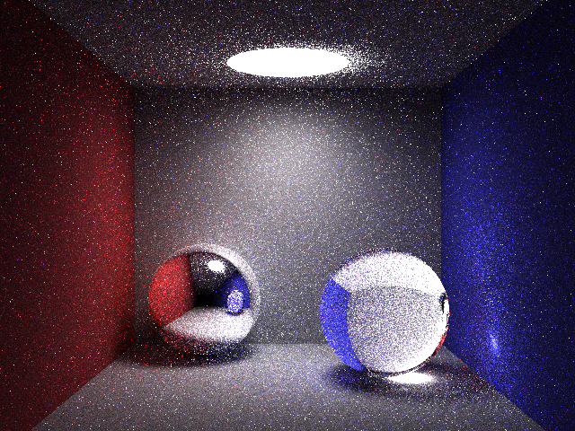

PPM（每轮40k个光子，迭代11轮，渲染约15分钟）

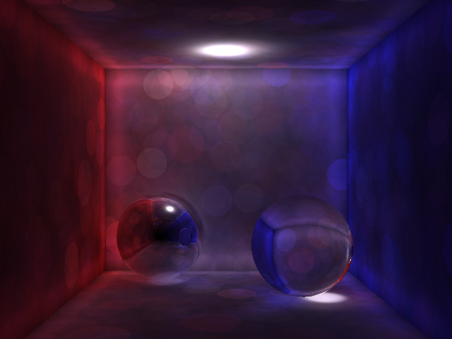

软阴影（面光源6*6随机采样，渲染约5s）

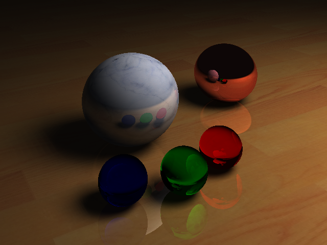

### 最终结果

光线追踪，最大深度5

分辨率2560*1920，x4超采样，不带景深，渲染约10分钟

面光源（6*6固定采样），点光源，旋转曲面，复杂网格，反射，折射

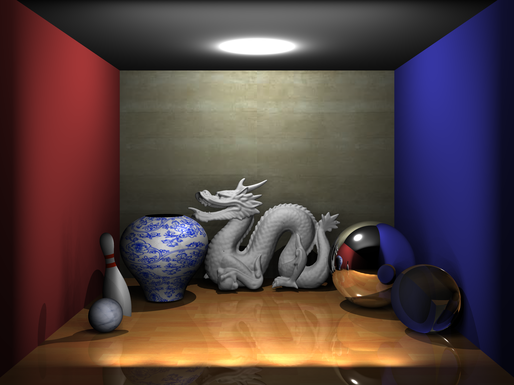

分辨率1280*960，x4超采样，带景深（采样8次），渲染约15分钟

总求交次数：包围盒：39.3e8，三角面片：5.4e8，球：4.5e8，平面：0.8e8

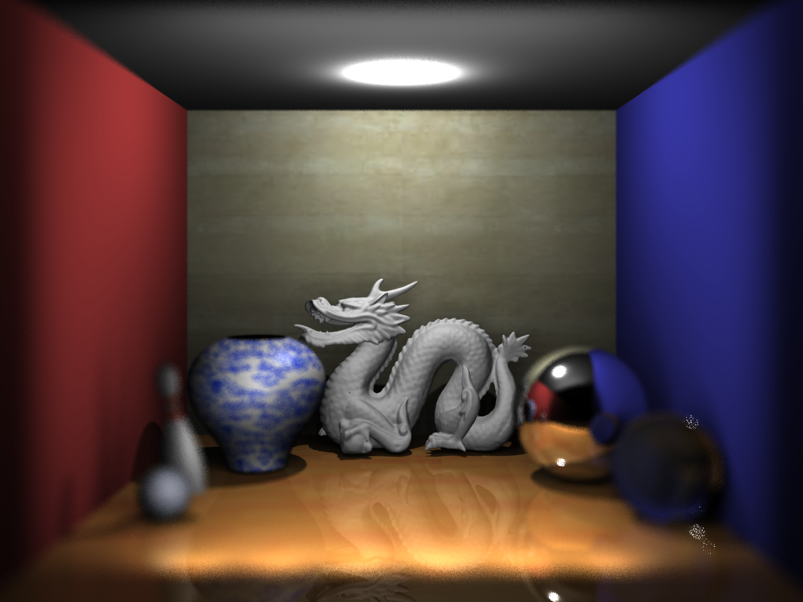


使用的网格

*注：旋转曲面生成的网格位于`data/output_objs`*

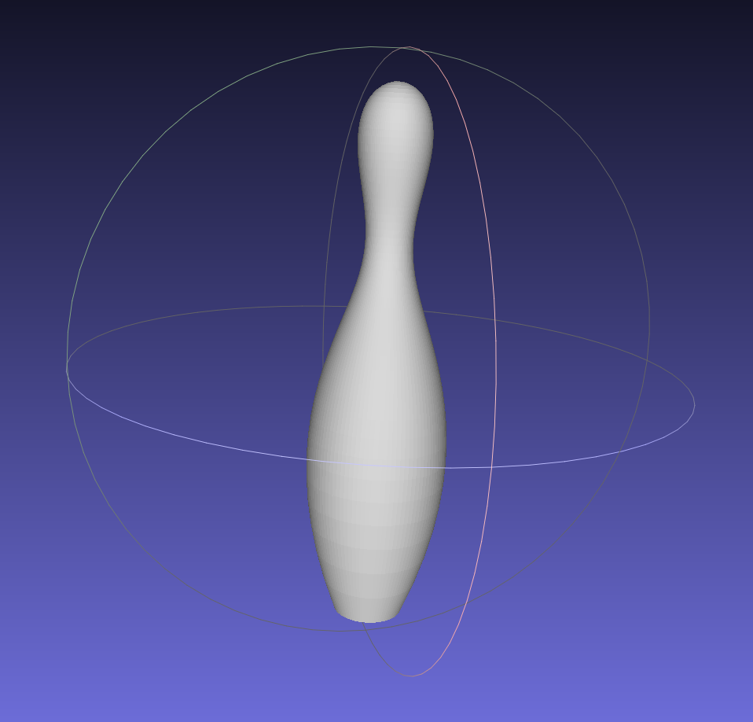

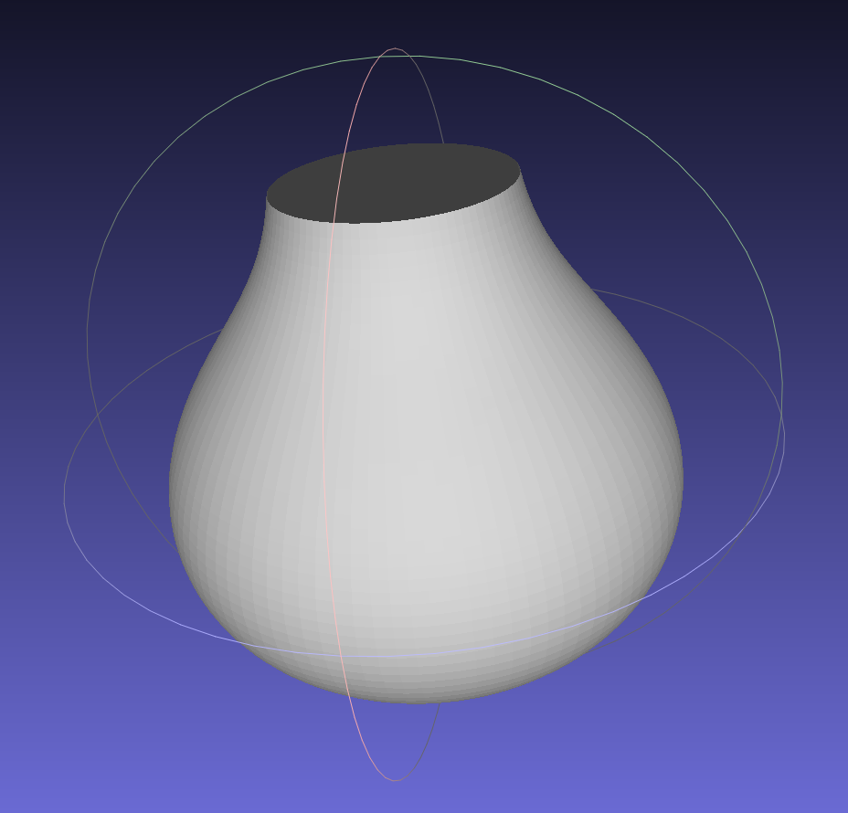

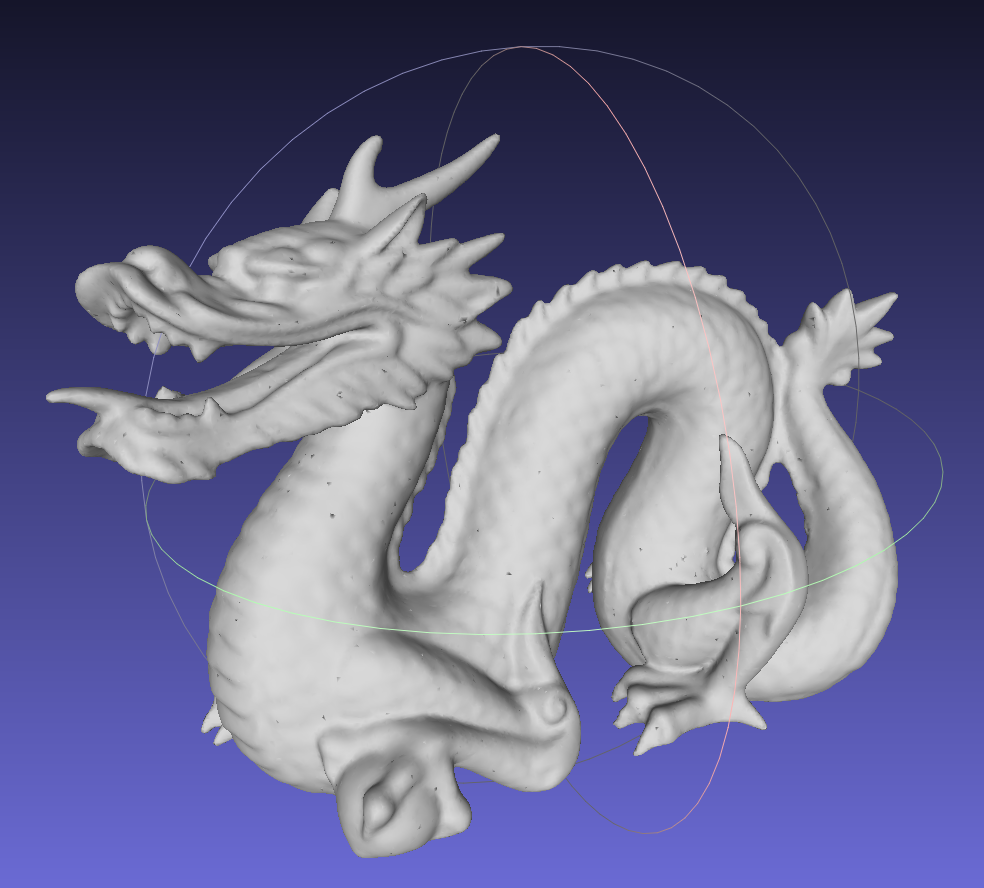